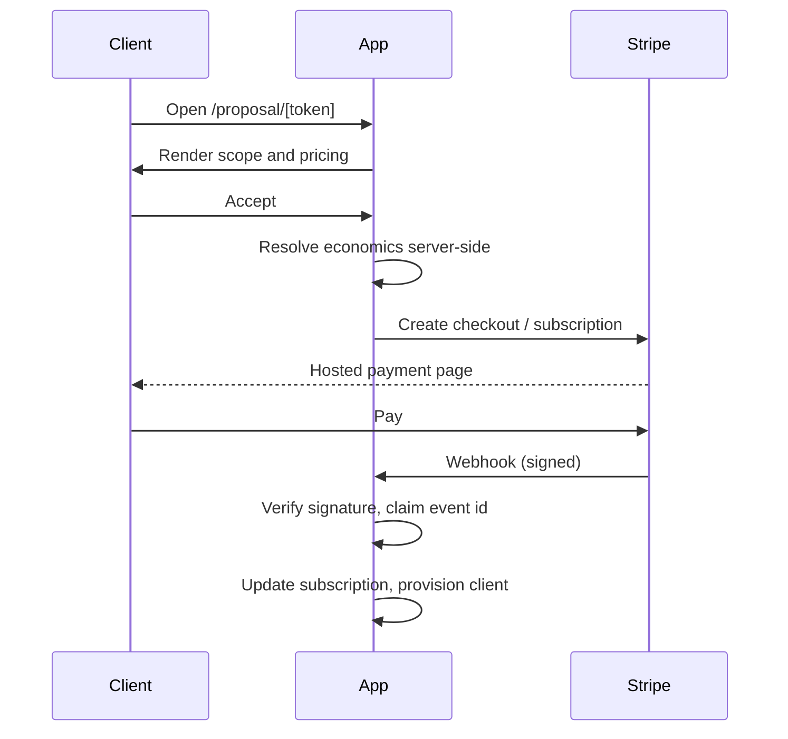
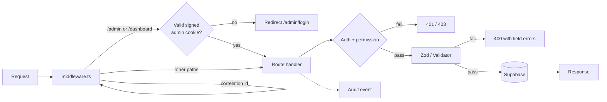
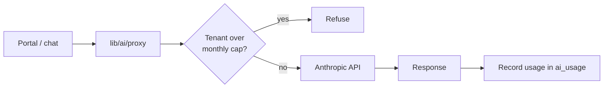

# Redmont Strategies Group

## Technical and Product Guide

**Category:** Business consulting website, client portal, and internal operations console
**Repository:** `redmontstrategiesgroup/rsg-website`
**Generated:** 2026-07-28

A single Next.js application that serves three audiences from one codebase: the public marketing site that generates leads, the authenticated client portal where engaged clients track their work, and the internal admin console the firm runs its own operations from. It handles the whole lifecycle — a stranger arriving from search, through qualification and booking, proposal and payment, to an active client with a project, a support queue, and a monthly subscription.

---

## Contents

1. [Product Overview](#1-product-overview)
2. [Feature Guide](#2-feature-guide)
3. [User Journeys](#3-user-journeys)
4. [Application Architecture](#4-application-architecture)
5. [Repository Structure](#5-repository-structure)
6. [Data Model](#6-data-model)
7. [Authentication and Permissions](#7-authentication-and-permissions)
8. [API and Server Operations](#8-api-and-server-operations)
9. [External Integrations](#9-external-integrations)
10. [Environment Configuration](#10-environment-configuration)
11. [Local Development](#11-local-development)
12. [Deployment](#12-deployment)
13. [Security Model](#13-security-model)
14. [Testing and Quality Assurance](#14-testing-and-quality-assurance)
15. [Operations and Maintenance](#15-operations-and-maintenance)
16. [Troubleshooting](#16-troubleshooting)
17. [Release Checklist](#17-release-checklist)
18. [Known Limitations](#18-known-limitations)
19. [Glossary](#19-glossary)
20. [Change Record](#20-change-record)

---

## 1. Product Overview

### What it does

Redmont Strategies Group (RSG) is a business consulting and strategy firm serving Plymouth County and the South Shore of Massachusetts. This application is the firm's entire digital operation:

- **Public site** — explains the firm's services, industry specializations, and process; captures and qualifies leads.
- **Client portal** — a private area where an engaged client sees their project, roadmap, reports, training material, support threads, team, and billing.
- **Admin console** — where staff manage leads, clients, proposals, scheduling, billing, security records, and content.

### The primary problem

Small and mid-sized service businesses lose money in the gap between marketing and operations: leads arrive and go stale, follow-up is manual, and nobody can see what happened. The firm sells systems that close that gap — and this application is both the shop window for that offer and a working demonstration of it, because the firm runs its own funnel on it.

### User types

| User | Access | What they do |
|---|---|---|
| Visitor | Public | Reads service and industry pages, runs ROI estimates, tries interactive demos, requests a consultation |
| Lead | Token link | Completes an assessment or questionnaire, books a call, views a proposal, pays an invoice |
| Client | Password + session | Signs into the portal: project, roadmap, reports, training, support, team, billing, Observatory |
| Admin staff | Password + session, role-scoped, optional MFA | Runs the console: leads, clients, proposals, scheduling, security center, content |

### Principal workflows

1. Visitor → contact or booking form → qualified lead → booked consultation.
2. Lead → proposal link → acceptance → Stripe subscription → provisioned client account.
3. Client → portal → service requests, roadmap approval, support threads, plan changes.
4. Staff → admin console → manage every record above, with an audit trail.

---

## 2. Feature Guide

### 2.1 Marketing site

**Purpose.** Convert search and referral traffic into qualified consultations.

**Surface.** Home, services (including a dedicated custom private-AI systems page), industries with per-vertical pages, process, capabilities, results, security standard, service area, FAQ, privacy, terms, and a set of intent-specific landing pages (AI automation, AI strategy, business consulting, CRM systems, operations consulting, systems audit, web development, managed services).

**Notable components.**

- **ROI calculator** (`components/industries/RoiCalculator.tsx`) — per-vertical estimator. Inputs, assumption rates, and the disclaimer are all admin-editable configuration, not hardcoded numbers; the arithmetic lives in `lib/industries/roi.ts`. Results render alongside the vertical's disclaimer, and the content schema *requires* a disclaimer to be present (`lib/industries/completeness.ts`).
- **Interactive demos** (`/demos`) — full simulated operating systems for home services, dental, gyms, and retail. Every demo surface carries a `SampleDataTag` reading "Interactive demonstration using sample data", and the demo shell states plainly that everything is sample data in an isolated session. The underlying businesses are fictional by design (`components/demos/types.ts`).
- **Chat widget** — site assistant backed by Anthropic. Degrades to a "not configured" notice when no API key is present, and to the contact form when the daily ceiling is reached.

**Limitations.** The demos do not connect to any real system; they are a product illustration. The ROI calculator produces estimates from user-supplied inputs and stated assumptions, not measured client results.

### 2.2 Lead capture and qualification

**Purpose.** Turn a form submission into a scored, routed lead.

**Flow.** Contact form (`components/ContactForm.tsx`) or booking funnel → server action / API route → validation → lead record → optional Resend notification → optional Turnstile verification. Lead scoring lives in `lib/lead-score.ts`; the pipeline in `lib/leads.ts`.

**Error behavior.** If Resend is unconfigured, the lead is still stored and no email is sent — capture never depends on delivery.

### 2.3 Scheduling and booking

**Purpose.** Let a qualified lead book a consultation without a back-and-forth.

**Surface.** `/book`, `/book/[slug]`, booking management by token, availability slots, qualification gating, and a "not eligible" path for leads that do not meet the rules.

**Mechanics.** Availability, qualification rules, and notification templates are admin-configured. A cron job (`/api/cron/scheduling`, every 5 minutes) drives reminders and state transitions. Timezone comes from `SCHEDULING_TIMEZONE`.

**Permissions.** Staff actions map to explicit permissions (`SCHEDULING_ACTION_PERMISSION`), so a scheduler can edit appointments but cannot, for example, manage billing.

### 2.4 Proposals, contracts, and payment

**Purpose.** Move an agreed scope to a signed, paid engagement.

**Flow.** Admin creates a proposal → client opens a tokenized link (`/proposal/[token]`, `/proposals/[token]`) → accepts or declines → acceptance resolves subscription economics **server-side** → Stripe checkout or billing portal session → webhook confirms → client account provisioned.

**Important property.** Pricing is never read from the Stripe webhook. Subscription economics are resolved at proposal acceptance on the server; the webhook only confirms state. This prevents a forged or replayed webhook from altering what a client is charged.

### 2.5 Client portal

**Purpose.** Give an engaged client one place to see their engagement.

**Sections.** Project, roadmap (with client approval), reports, training, support threads, team, workspace, billing, and Observatory.

**Access.** Password authentication, signed session cookie, and per-request revocation checks. Every portal query is scoped to the caller's `client_id`.

### 2.6 Observatory

**Purpose.** A simulation and decision-support app mounted inside the portal.

**Mechanics.** The simulation engine runs in the browser. The server holds the Anthropic key, the grounding prompts, and the output schemas, and exposes two operations: parse a plain-language question into a structured scenario, and produce an evidence-grounded decision brief. Scenarios and reports persist per tenant (`obs_scenarios`, `obs_reports`), scoped by `client_id` on every read, write, and delete.

### 2.7 Admin console

**Purpose.** Run the firm.

**Sections.** Leads, clients, proposals, scheduling, managed services, industries content, private-AI opportunities, Connect page configuration, DSAR handling, audit log, MFA enrollment, and a Security Center (incidents, vendors, retention, approvals, tests, policies).

**Access control.** Ten roles, twenty-nine permissions, optional per-role MFA enforcement, and an audit event written for consequential actions.

### 2.8 Executive intelligence dashboard

**Purpose.** Normalized ingestion and review of briefing material.

**Mechanics.** A sender posts JSON to `POST /api/briefs/ingest` (shared-secret authenticated); records are read through the server-only service-role client at `/dashboard`. Browser code never receives a Supabase secret. See `DASHBOARD.md` for the ingestion contract.

---

## 3. User Journeys

### 3.1 Visitor to booked consultation

**Entry.** Organic search, referral, or a QR code on a business card (`/r/connect`).
**Authentication.** None.

1. Visitor lands on a service or industry page.
2. Optionally runs the ROI calculator or opens a demo.
3. Submits the contact form or enters the booking funnel.
4. Input is validated server-side; Turnstile is verified when configured.
5. A lead record is created and scored.
6. Qualification rules decide eligibility; eligible leads see availability and book.
7. Confirmation page, plus email when Resend is configured.

**Success.** A booked appointment and a scored lead visible in the console.
**Error recovery.** Validation errors return field-level messages. Ineligible leads are routed to `/booking/noteligible` rather than being silently dropped. Storage failures surface an error rather than a false confirmation.

### 3.2 Proposal to paying client

**Entry.** Tokenized proposal link.
**Authentication.** Possession of the token (high-entropy, generated with `randomBytes`).



**Success.** An active subscription and a provisioned portal account.
**Error recovery.** Unsigned or tampered webhooks are rejected with 400. Duplicate event ids are skipped. Storage failures return 500 so Stripe retries.

### 3.3 Client using the portal

**Entry.** `/portal`.
**Authentication.** Email and password, then a signed session cookie.

1. Client signs in; a session row is created and the cookie is signed.
2. Each request re-checks that the session is still live (revocation checkpoint) and renews it (sliding expiration).
3. The client reads their project, roadmap, reports, training, and support threads — all scoped to their `client_id`.
4. They can raise service requests, approve a roadmap, or request a plan change.

**Error recovery.** A revoked session clears the cookie and returns 401 within the keepalive window (10 minutes). Unconfigured Stripe degrades billing actions rather than crashing the page.

### 3.4 Staff running the console

**Entry.** `/admin/login`.
**Authentication.** Email and password, TOTP second factor when the role requires it.

1. Credentials are checked against `public.admins`, or against the environment bootstrap owner when no rows exist.
2. The edge middleware verifies the cookie signature before the page renders.
3. Each API action re-checks the session, the role's permission, and MFA requirement independently.
4. Consequential actions write an audit event.

---

## 4. Application Architecture

### Stack

| Layer | Technology |
|---|---|
| Framework | Next.js 15.5 (App Router), React 19 |
| Language | TypeScript, strict, no build-time error suppression |
| Styling | Tailwind CSS 3.4, custom design tokens |
| Motion | Framer Motion, Lenis (desktop only, reduced-motion aware) |
| Database | Supabase (PostgreSQL), server-only service-role client |
| Auth | Custom HMAC-signed cookie sessions, TOTP MFA |
| Payments | Stripe (subscriptions, billing portal, webhooks) |
| Email | Resend |
| AI | Anthropic SDK behind an internal proxy with per-tenant metering |
| Rate limiting | Upstash Redis, with an in-process fallback |
| Monitoring | Sentry (client, server, edge) |
| Hosting | Vercel, including cron |

### Request lifecycle



Every request receives a correlation id, propagated through `lib/integration-log.ts` and `lib/observability.ts` so an integration failure can be traced afterwards.

### Authorization model

Authorization is enforced in three independent places, deliberately:

1. **Edge middleware** — gates `/admin` and `/dashboard` page loads by verifying the cookie's HMAC signature, role, and expiry.
2. **Route handlers** — `requireAdmin(permission)`, `requireAppApi()`, or an explicit session check, per request.
3. **Data layer** — every tenant query filters on `client_id`; a defense-in-depth RLS migration is applied on top.

The middleware is a convenience gate, not the security boundary. Removing it would not grant access, because handlers verify independently.

### AI request flow



The API key never reaches the browser. The cap is checked before the call and usage recorded after. When Supabase is configured but the usage read fails, the cap check **fails closed** — a metering outage must not silently uncap a shared key.

---

## 5. Repository Structure

| Path | Responsibility |
|---|---|
| `app/(marketing)/` | Public pages, grouped under a shared layout with navbar, footer, chat, consent, and the skip link |
| `app/admin/`, `app/dashboard/` | Internal console and executive dashboard |
| `app/portal/` | Authenticated client portal |
| `app/api/` | 64 route handlers, grouped by audience (`admin/`, `portal/`, `booking/`, `cron/`, `stripe/`) |
| `app/actions/` | Server actions (contact form) |
| `components/` | UI, grouped by surface: `admin/`, `portal/`, `demos/`, `industries/`, `booking/`, `security/` |
| `lib/` | Business logic. Auth, store, validation, permissions, and one subdirectory per domain (`ai/`, `lifecycle/`, `managed-services/`, `scheduling/`, `security-center/`, `observatory/`, `webhooks/`, `privacy/`) |
| `supabase/migrations/` | 26 ordered SQL migrations |
| `tests/` | 20 `node:test` files, 157 tests |
| `docs/` | Domain documentation and this guide |
| `public/` | Brand assets and static files |
| `scripts/` | Operational scripts (integration run export) |

---

## 6. Data Model

### Principal entities

| Entity | Purpose | Ownership |
|---|---|---|
| `leads` | Inbound enquiries, scored and status-tracked | Firm-wide, staff-visible |
| `clients` | Engaged customers with portal access | Self (by session), staff |
| `sessions` | Live session records enabling revocation | Client / admin |
| `admins` | Staff accounts with roles and MFA secrets | Firm |
| `appointments` / scheduling tables | Bookings, availability, qualification rules | Firm |
| `proposals` | Scope and pricing, tokenized for client access | Client (by token) |
| Managed-services tables | Plans, subscriptions, invoices, service requests, roadmaps, reports | Client |
| `obs_scenarios`, `obs_reports` | Observatory simulation specs and generated reports | Client |
| `ai_usage` | Per-tenant token accounting | Firm |
| `audit_events` | Who did what, when | Firm |
| Security Center tables | Incidents, vendors, retention rules, approvals, tests | Firm |

### Ownership and deletion

Tenant-owned tables carry `client_id` and every query filters on it. Observatory upserts key on `(client_id, spec_id)` and `(client_id, report_id)`, so a tenant cannot collide with or overwrite another tenant's row.

Erasure is handled by `lib/privacy/erase.ts` and exposed through the admin DSAR route, with `tests/privacy-erase.test.ts` covering it.

### Sensitive fields

Integration secrets are column-restricted (migration `20260712212528`). Session identifiers support revocation. Admin MFA secrets live alongside admin records. None of these are exposed through public serializers — `lib/seed.ts`'s `toPublic()` is the boundary that decides what a client record looks like over the wire.

### Migration discipline

Migrations are ordered and additive. The two most recent tighten posture rather than add features: `20260728040701_enable_rls_defense_in_depth.sql` and `20260728183707_revoke_public_definer_rpc.sql`.

> **Operational note.** The repository's migration list is the source of truth for schema *intent*. Confirm against the live project before assuming parity.

---

## 7. Authentication and Permissions

### Methods

- **Clients** — email and password, salted and hashed (`randomBytes` salt, `lib/auth.ts`).
- **Admins** — email and password against `public.admins`; a bootstrap owner from `ADMIN_EMAIL` / `ADMIN_PASSWORD` when no rows exist. TOTP second factor per `lib/totp.ts`, enforced per role.

### Session model

Sessions are HMAC-SHA256 signed cookies carrying a payload and a `sid`. The `sid` maps to a session row, which makes revocation possible — signing alone cannot be revoked. Sessions renew on activity (sliding expiration) and are re-validated on each authenticated request.

`AUTH_SECRET` is **required in production**; `lib/auth.ts` throws without it. In local development a per-process random secret is generated so nobody is locked out.

### Roles

Ten roles, twenty-nine permissions (`lib/scheduling/permissions.ts`):

| Role | Scope |
|---|---|
| `owner` | All permissions. The environment bootstrap admin is always owner |
| `administrator` | All except `manage_team` |
| `manager` | Appointments, qualification, leads, analytics, incidents, AI approvals, projects, support, training |
| `scheduler` | Appointments, availability, qualification, analytics, leads |
| `consultant` | Appointments, qualification, private notes |
| `sales` | Appointments, qualification and override, analytics, leads, proposals |
| `employee` | Appointments, qualification, analytics, leads |
| `contractor` | View appointments and qualification only |
| `security_reviewer` | Security Center, audit log, analytics — no client or billing access |
| `viewer` | View appointments and analytics only |

Permissions are checked per operation, not per page. `SCHEDULING_ACTION_PERMISSION` maps each POST action to the permission it requires.

---

## 8. API and Server Operations

64 route handlers. Grouped by the authentication they demand:

| Group | Authentication | Notes |
|---|---|---|
| `/api/admin/*`, `/api/dashboard/*` | Admin session + named permission (+ MFA when required) | Mutators additionally rate-limited per admin |
| `/api/portal/*` | Client session, scoped to `client_id` | Observatory routes use `requireAppApi()` |
| `/api/booking/*`, `/api/assessment/*`, `/api/proposal(s)/*`, `/api/contract/*`, `/api/pay/*`, `/api/questionnaire/*` | High-entropy token in the path | Rate-limited |
| `/api/cron/*`, `/api/health/integrations` | `CRON_SECRET` | Invoked by Vercel cron |
| `/api/stripe/webhook` | Stripe signature | Replay-guarded by event id |
| `/api/briefs/ingest` | `BRIEF_INGESTION_SECRET` | Dashboard ingestion |
| `/api/chat`, `/api/subscribe`, `/api/demorequest`, `/api/analytics`, `/api/connect/event` | Public, rate-limited | Validated with Zod |
| `/api/health` | None | Liveness; `?ready=1` adds a Supabase probe |

### Verified behavior

Every protected endpoint was probed without credentials against a running server during this pass. Admin reads returned 401, admin and portal mutations returned 403, cron routes returned 401, and an unsigned Stripe webhook returned 400. A forged admin cookie carrying `{"role":"admin"}` with a valid future expiry but an invalid signature was rejected at the edge (redirect to login) and by the API (401).

### Error conventions

- `400` — validation failure, with field-level messages where the form needs them.
- `401` — no or invalid session.
- `403` — authenticated but lacking the permission, or rate-limited mutation.
- `409` — conflict (for example, a client email already in use).
- `500` — server or storage failure. Returned deliberately to webhooks so the provider retries.

---

## 9. External Integrations

| Integration | Why | Configured by | Failure behavior |
|---|---|---|---|
| **Supabase** | Primary datastore, service-role access from the server only | `SUPABASE_URL`, `SUPABASE_SERVICE_ROLE_KEY` | App runs without it in development; `/api/health?ready=1` returns 503 when unreachable |
| **Stripe** | Subscriptions, billing portal, invoices | Stripe keys, webhook secret | Billing actions degrade with an "unconfigured" path rather than crashing |
| **Anthropic** | Chat assistant, Observatory copilot, briefs | `ANTHROPIC_API_KEY`, optional `CHAT_MODEL` | Chat widget shows a "not configured" notice; the rest of the site is unaffected |
| **Resend** | Lead notifications, client email | `RESEND_API_KEY`, `CONTACT_TO_EMAIL`, `CONTACT_FROM_EMAIL` | Leads are still stored; no email is sent |
| **Upstash Redis** | Distributed rate limiting | Upstash env vars | Falls back to in-process limiting |
| **Cloudflare Turnstile** | Bot mitigation on public forms | `NEXT_PUBLIC_TURNSTILE_SITE_KEY`, `TURNSTILE_SECRET_KEY` | Verification skipped when unconfigured |
| **Sentry** | Error and performance monitoring | Sentry DSN | Disabled without a DSN |
| **Vercel Cron** | Scheduled scheduling and registry jobs | `vercel.json`, `CRON_SECRET` | Routes reject unauthenticated calls |

Every one of these is genuinely wired. None is a placeholder.

---

## 10. Environment Configuration

| Variable | Purpose | Required | Format | Development | Production |
|---|---|---|---|---|---|
| `NEXT_PUBLIC_SITE_URL` | Canonical URL for canonicals, sitemap, robots, OG tags | No | URL, no trailing slash | Defaults to the production domain | Set explicitly |
| `NEXT_PUBLIC_ENABLE_DEMO_DATA` | Seeds sample portal accounts | No | `true` / `false` | Optional | **Must be false** |
| `AUTH_SECRET` | Signs session cookies | **Yes** | Long random string (≥16 chars) | Random per process if unset | App refuses to start without it |
| `ADMIN_EMAIL` | Bootstrap owner account | Yes for first login | Email | Set locally | Set, or use `public.admins` rows |
| `ADMIN_PASSWORD` | Bootstrap owner password | Yes for first login | Strong password | Set locally | Prefer DB admins |
| `SUPABASE_URL` | Project URL | Yes in production | URL | Optional | Required |
| `SUPABASE_SERVICE_ROLE_KEY` | Server-only DB access | Yes in production | Secret key | Optional | Required. Never expose to the browser |
| `ANTHROPIC_API_KEY` | Chat and AI features | No | Secret key | Optional | Required for AI features |
| `CHAT_MODEL` | Override the chat model | No | Model id | Optional | Optional |
| `CHAT_DAILY_LIMIT` | Site-wide daily chat ceiling | No | Integer (default 400) | Optional | Optional |
| `RESEND_API_KEY` | Transactional email | No | Secret key | Optional | Required for email |
| `CONTACT_TO_EMAIL` | Lead notification recipient | No | Email | Optional | Set |
| `CONTACT_FROM_EMAIL` | Verified sender | No | Email | Optional | Set, domain-verified |
| `NEXT_PUBLIC_TURNSTILE_SITE_KEY` | Turnstile widget | No | Site key | Optional | Recommended |
| `TURNSTILE_SECRET_KEY` | Turnstile verification | No | Secret key | Optional | Recommended |
| `CRON_SECRET` | Authenticates cron routes | Yes if cron enabled | Random string | Optional | Required |
| `BRIEF_INGESTION_SECRET` | Authenticates dashboard ingestion | Yes if used | Random string | Optional | Required if used |
| `BOOKING_URL` / `NEXT_PUBLIC_BOOKING_URL` | External booking override | No | URL | Optional | Optional |
| `SCHEDULING_TIMEZONE` | Scheduling timezone | No | IANA zone | Optional | Set |

Stripe, Upstash, and Sentry variables follow each provider's standard names and are read by their SDKs.

---

## 11. Local Development

### Prerequisites

- Node.js 20 (matches CI)
- npm (the repository uses `package-lock.json` — do not introduce a second package manager)

### Setup

```bash
npm ci
cp .env.example .env.local
```

Generate a session secret:

```bash
node -e "console.log(require('crypto').randomBytes(48).toString('hex'))"
```

Put it in `AUTH_SECRET`, set `ADMIN_EMAIL` and `ADMIN_PASSWORD`, and leave the rest empty to start — the app runs without Supabase, Stripe, Anthropic, or Resend, degrading each feature honestly.

### Commands

```bash
npm run dev
```

```bash
npm test
```

```bash
npm run typecheck
```

```bash
npm run lint
```

```bash
npm run build
```

### Database

Migrations live in `supabase/migrations/` and apply in filename order via the Supabase CLI or dashboard. Apply them to a fresh project before pointing the app at it.

### Common setup errors

- **App throws on start in production mode** — `AUTH_SECRET` is unset. Required, no fallback.
- **Admin login always fails** — no `public.admins` rows and no `ADMIN_EMAIL`/`ADMIN_PASSWORD`. This fails closed by design.
- **`ENOENT: routes-manifest.json` / `Cannot find module './NNNN.js'`** — two Next processes are sharing `.next`. Run only one dev server or build per checkout at a time.

---

## 12. Deployment

**Target.** Vercel. `vercel.json` declares the two cron jobs; there is no other deployment configuration in the repository, so treat Vercel as the supported target.

**Required services.** Supabase project, Stripe account with webhook endpoint, Resend with a verified sending domain, Anthropic API key. Upstash and Sentry are recommended but optional.

**Process.**

1. Push to `main`. CI runs lint, typecheck, test, and build (`.github/workflows`).
2. Set every production environment variable in Vercel, including `AUTH_SECRET` and `CRON_SECRET`.
3. Apply outstanding migrations to the production Supabase project **before** the deployment that depends on them.
4. Point the Stripe webhook at `/api/stripe/webhook` and set the signing secret.
5. Configure the domain and confirm `NEXT_PUBLIC_SITE_URL` matches it — canonicals, sitemap, and robots derive from it.

**Post-deployment verification.**

- `GET /api/health?ready=1` returns `ready`.
- `/admin/login` rejects a bad password and accepts a good one.
- A test lead reaches storage and triggers the notification email.
- A Stripe test event is accepted; a tampered one is rejected.

**Rollback.** Vercel's previous deployment can be promoted immediately. Database migrations are **not** automatically reversed — a rollback across a schema change requires a considered forward fix, not a redeploy.

---

## 13. Security Model

This section describes the controls that are implemented. It is not a claim that the system is free of vulnerabilities.

### Trust boundaries

The browser is untrusted. The service-role Supabase key, the Anthropic key, and all provider secrets exist only on the server. Tokenized links are bearer credentials — possession is access — and are generated with `randomBytes`.

### Implemented controls

- **Session integrity** — HMAC-SHA256 signed cookies; signature verified at the edge in constant time and again in handlers.
- **Revocation** — sessions carry a `sid` backed by a row, re-checked per request.
- **Authorization** — role and permission checked per operation, independently of the page gate.
- **Tenant isolation** — every tenant query filters on `client_id`; RLS applied as a second layer.
- **Input validation** — Zod schemas and a shared `Validator` with explicit length limits.
- **MFA** — TOTP, enforceable per role.
- **Rate limiting** — public endpoints and admin mutators, Upstash-backed with a local fallback.
- **Webhook security** — Stripe signature verification plus replay guard on event id; pricing never taken from the webhook.
- **AI safety** — key held server-side; per-tenant monthly token cap that fails closed on a metering read error; usage recorded per call.
- **Logging hygiene** — Sentry configured with `sendDefaultPii: false` on client, server, and edge; Session Replay masks all text and blocks media. Audit write failures log at error level so an empty trail is distinguishable from an uneventful one.
- **Bot mitigation** — Turnstile on public forms when configured.
- **Fail-closed defaults** — no admin credentials means no admin login.

### Credentials

Temporary client passwords generated in the console use `crypto.getRandomValues` over an unambiguous alphabet. They are shown once for the operator to transmit and are stored hashed.

---

## 14. Testing and Quality Assurance

### Categories

157 tests across 20 files, run with the built-in Node test runner (`node --test`). They concentrate on logic where a mistake is expensive rather than on rendering:

| Area | Files |
|---|---|
| Security and access | `security-permissions.test.ts`, `permissions.test.ts`, `cron-auth.test.ts`, `totp.test.ts`, `rate-limit.test.ts` |
| Payments and webhooks | `webhooks.test.ts` |
| AI | `ai-proxy.test.ts`, `ai-usage.test.ts`, `private-ai-architecture.test.ts` |
| Lead and booking flow | `lead-pipeline.test.ts`, `booking-intake.test.ts`, `scheduling-qualification.test.ts`, `demo-request.test.ts` |
| Lifecycle and services | `lifecycle.test.ts`, `managed-services.test.ts` |
| Privacy | `privacy-erase.test.ts` |
| Other | `brief-schema.test.ts`, `connect-page.test.ts`, `integration-log.test.ts`, `retail-demo.test.ts` |

The webhook suite is a good example of the standard: it verifies the exact signing scheme receivers use, rejects stale timestamps, replays, tampered bodies, and wrong secrets, and asserts that a wrong-length signature does not throw.

### Commands

```bash
npm run lint && npm run typecheck && npm test && npm run build
```

### Current limitations

There is no browser-level end-to-end suite and no automated accessibility assertion. Full-journey verification (sign in, book, pay) is manual and depends on configured providers.

### Manual verification checklist

- [ ] Contact form stores a lead and sends notification
- [ ] Booking funnel qualifies, offers slots, and confirms
- [ ] Admin login rejects bad credentials; MFA prompts where required
- [ ] Portal shows only the signed-in client's records
- [ ] Proposal accept creates a subscription
- [ ] Stripe webhook accepted when signed, rejected when not
- [ ] Chat degrades gracefully with no API key

---

## 15. Operations and Maintenance

**Monitoring.** Sentry across all three runtimes, PII suppressed. Correlation ids thread through integration logs.

**Health checks.** `/api/health` for liveness; `?ready=1` adds a Supabase probe returning 503 when unready. Point the platform's health check at the plain endpoint and any dependency alerting at the ready variant.

**Scheduled tasks.** `/api/cron/scheduling` every 5 minutes; `/api/cron/registry` daily at 03:17. Both require `CRON_SECRET`.

**Integration triage.** `docs/integration-triage.md` documents the procedure; `scripts/export-integration-runs.mjs` exports run history.

**Backups.** Supabase's own backup schedule is the backstop. Verify the retention setting on the production project and confirm a restore has actually been tested — an untested backup is a hypothesis.

**Data retention.** The Security Center holds retention rules; `lib/privacy/erase.ts` implements erasure. DSAR requests are handled through the admin route.

**Dependency updates.** CI runs the full gate set on every push and pull request, so dependency bumps are verifiable before merge.

---

## 16. Troubleshooting

| Symptom | Likely cause | Resolution |
|---|---|---|
| App refuses to start | `AUTH_SECRET` unset | Set it. There is deliberately no production fallback |
| Admin login always fails | No `public.admins` rows and no bootstrap env credentials | Set `ADMIN_EMAIL`/`ADMIN_PASSWORD` or insert an admin row |
| Admin redirected to login despite correct password | `AUTH_SECRET` differs between the edge and the app, or the cookie is stale | Confirm one value across all environments; clear the cookie |
| AI features refuse every request | Supabase configured but `ai_usage` missing, so the cap fails closed | Apply the `ai_usage` migration. Do not "fix" this by failing open |
| Audit log appears empty | `audit_events` unmigrated | Check for `[audit] WRITE FAILED` in logs; apply the migration |
| Leads captured but no email | Resend unconfigured or sender domain unverified | Set `RESEND_API_KEY` and verify the domain |
| Stripe webhook always 400 | Wrong signing secret, or the body was parsed before verification | Use the endpoint's own secret; the raw body is required |
| Subscription not updating after payment | Event id already claimed by a partially failed earlier attempt | Reconcile manually; the admin email and event log record it |
| `/api/health?ready=1` returns 503 | Supabase unset or unreachable | Check credentials and project status |
| Build fails with missing manifest, or `Cannot find module './NNNN.js'` | Two Next processes sharing `.next` | Run one build or dev server per checkout |
| Chat widget shows "not configured" | No `ANTHROPIC_API_KEY` | Set the key |
| Public pages 404 unexpectedly | Token-gated route reached without a token | Expected for `/assessment` and `/prepare`, which require `[token]` |

---

## 17. Release Checklist

- [ ] **Environment** — every required variable set in Vercel; `NEXT_PUBLIC_ENABLE_DEMO_DATA` is false
- [ ] **Database** — all 26 migrations applied to production; `ai_usage` and `audit_events` confirmed present
- [ ] **Security** — `AUTH_SECRET` unique and long; MFA enforced for privileged roles; bootstrap admin credentials rotated or removed in favour of DB admins
- [ ] **Tests** — `npm test` green
- [ ] **Build** — `npm run lint && npm run typecheck && npm run build` green
- [ ] **Monitoring** — Sentry DSN set; a test error observed
- [ ] **Backups** — Supabase retention confirmed and a restore tested
- [ ] **Integrations** — Stripe webhook registered and verified; Resend domain verified; Turnstile keys set; `CRON_SECRET` set
- [ ] **Domain** — DNS live and `NEXT_PUBLIC_SITE_URL` matches
- [ ] **Legal pages** — privacy and terms reviewed and current
- [ ] **Accessibility** — skip link reachable; keyboard path through the primary funnel walked
- [ ] **Responsive** — funnel and portal checked at small viewport
- [ ] **Core workflows** — the manual checklist in section 14 completed

---

## 18. Known Limitations

- No browser-level end-to-end test suite; full-journey verification is manual.
- No automated accessibility assertions in CI. This pass added the missing bypass block and verified reduced-motion handling, but colour-contrast and screen-reader behaviour have not been machine-verified.
- Interactive demos are illustrations driven by fictional sample data. They demonstrate the product concept; they do not connect to a live system.
- ROI calculator output is an estimate derived from user inputs and stated assumptions, not from measured client outcomes.
- Stripe webhook replay guard claims the event id before processing. A retry after a *partial* failure is treated as a duplicate and skipped — a deliberate trade-off, with the admin email and event log as the reconciliation path.
- The repository's migration list reflects intent; parity with the live database must be confirmed operationally, not assumed.
- Session revocation for open tabs takes effect within the 10-minute keepalive window, not instantly.

---

## 19. Glossary

| Term | Meaning |
|---|---|
| **Lead** | An inbound enquiry, scored and status-tracked, before any engagement exists |
| **Client** | An engaged customer with a portal account |
| **Admin / staff** | An internal user of the console, holding one of ten roles |
| **Bootstrap owner** | The environment-configured admin used when no database admin rows exist |
| **Observatory** | The simulation and decision-support app mounted inside the portal |
| **Connect** | The QR-linked landing surface (`/r/connect`) used from physical cards |
| **DSAR** | Data Subject Access Request — the export or erasure path for personal data |
| **Managed services** | The recurring subscription product: plans, roadmaps, reports, support |
| **Correlation id** | A per-request identifier threaded through logs to trace one request end to end |
| **Fail closed** | Denying access when a check cannot be completed, rather than allowing it |
| **Sample data tag** | The required label marking every demo surface as a demonstration |

---

## 20. Change Record

Production refinement pass, 2026-07-28.

| Change | Area |
|---|---|
| Edge admin gate now verifies the cookie's HMAC signature in constant time, not just its decoded payload. A forged unsigned cookie with `role: admin` previously passed the page gate | Security |
| `isTenantOverAiCap` failure modes split: fails open when Supabase is unconfigured, fails closed when configured and the read fails. Previously any read error silently removed the cap | Security |
| Audit write failures raised from `console.warn` to `console.error` with action and actor, so an unmigrated `audit_events` table is visible rather than silent | Observability |
| `sendDefaultPii: false` set on all three Sentry runtimes; Session Replay masking pinned | Privacy |
| Client portal password generator moved from `Math.random()` to `crypto.getRandomValues` over an unambiguous alphabet. The generated value is the client's real credential | Security |
| Added a skip-to-content link with a focusable target across the marketing site (WCAG 2.4.1, Level A) — previously absent | Accessibility |
| Added `docs/project-ebook.md` and a root `README.md` | Documentation |

Verification performed during the pass: lint, typecheck, 157 tests, and a production build all green; every protected API endpoint probed unauthenticated and confirmed to fail closed; a forged admin cookie confirmed rejected at both the edge and the API; all public marketing pages confirmed rendering with the skip link present.

Areas deliberately left unchanged: authorization architecture, tenant scoping, webhook handling, validation layer, and the demo labelling system were traced and found sound.
